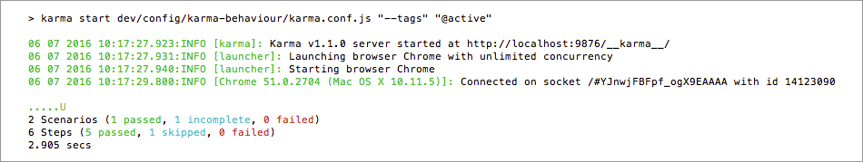
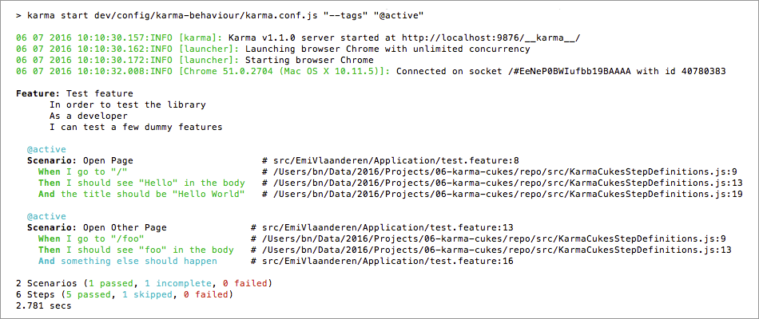

# Karma-Cukes

Karma plugin for running Gherkin feature files against CucumberJS in end-to-end tests.

## Idea

* [Karma](http://karma-runner.github.io/) is a developer-friendly tool for running tests in real browsers,
with direct access to client-side markup and code (without needing a Selenium tunnel).
* [CucumberJS](https://github.com/cucumber/cucumber-js) enables end-to-end tests and stakeholder-friendly, 
living documentation.

Bringing these two together could simplify the development workflow from story to spec through a 
unified set of tools.

#### Main features of this Karma plugin

* Comes bundled with "Progress", "Pretty", and "JSON" reporters that are more in line with 
  the official Cucumber reporters (no HTML reporter yet, this package is more targeted at command-line users).
* The API and syntax for registering step definitions and other support code is compatible with CucumberJS
  (i.e. step definition files can use `module.exports`).
* Native access to the browser, jQuery, etc.
* A single toolkit for both Story BDD and Spec BDD.
* Tested with Chrome, Firefox, PhantomJS

### Existing alternatives

#### Selenium/Webdriver with built-in CucumberJS framework

While Webdriver (Selenium) offers near out-of-the-box support for Cucumber, the generated reports 
lack the level of detail that "native" Cucumber provides. They don't allow to auto-generate
living documentation from report files (e.g. feature descriptions are missing and both feature and
scenario names get normalized to underscored identifiers).

#### Other Karma-CucumberJS adapters

They basically have the same issues as Webdriver-Cucumber. There are good [jUnit-reporters](https://www.npmjs.com/package/karma-junit-reporter)
but I could not find proper "Progress", "Pretty", or "JSON" formatters that behave like the ones a Cucumber (or Behat in my case) developer is 
used to. The ones I tested also did not work with PhantomJS and Firefox.

### Solution

The two main options were:

* writing a custom adapter + custom Cucumber-compatible reporters for Webdriver, or
* writing a custom adapter + custom Cucumber-compatible reporters for Karma.

This package goes for the second option, which –from looking at available adapters—,
seemed to be the lower-hanging fruit. I'm not so sure about this anymore *after* writing
the plugin, but here we are ;-)

#### Limitations compared to Webdriver

* Only PhantomJS offers an API for [taking screenshots](http://stackoverflow.com/a/34695107)
  through Karma (AFAIK), while Webdriver provides this feature for all browsers.

* The Browser reports are not fully identical, e.g. PhantomJS and Firefox report step locations
  instead of step *definition* locations (due a patched `Error.captureStackTrace`).

* There is only a minimal Browser API for visiting URLs in end-to-end tests. 
  The rest is native browser access and up to you (which I personally think is actually an advantage).

* No access to response headers (except for AJAX-based requests), 
  but could be doable via [Service Workers](https://github.com/gmetais/sw-get-headers)

* For each non-CORS-enabled target server to be used in end-to-end tests, a proxy needs to 
  be defined in the Karma configuration file.

## Installation

    npm install karma-cukes --save-dev

Peer dependencies: `jquery` (any version), `cucumber` (1.*), and of course `karma` (any version)

## Configuration (karma.conf.js)

    config.set({

        // activate framework
        frameworks: ['karma-cukes'],

        // specify feature files and support code
        files: [
            { pattern: 'dev/**/*.feature', included: false },
            'dev/**/step-definitions.js',
            'dev/**/hooks.js'
        ],

        // forward command line arguments to CucumberJS
        client: {
            args: process.argv.slice(4),
        },

        // activate reporters (kc-progress, kc-pretty, and/or kc-json)
        reporters: ['kc-pretty', 'kc-json'],
        
        // configure the JSON formatter
        kcJsonReporter: {
            outputDir: 'dev/reports/behaviour',
            outputFile: 'karma-cukes-{shortBrowserName}.json' // supported placeholders: `shortBrowserName`, `browserName`
        },
        
        // enable colors in the output
        colors: true,

        // proxy test server requests for end-to-end testing
        proxies: {
            "/": "http://localhost:8889/"
        },
        
        // use a root URL for the karma runner that does not interfere with proxied sites
        urlRoot: "/__karma__/",

        ...

    })

## Running features

    // all scenarios
    $ ./node_modules/.bin/karma start path/to/karma.conf.js

    // tagged scenarios
    $ ./node_modules/.bin/karma start path/to/karma.conf.js -- --tags @ui

## Assertion utils

Karma-Cukes comes with 3 (basic) assertion methods that are accessible from step definitions.

* `this.assert.ok(condition, callback, message)`
* `this.assert.equal(actual, expected, callback, message)`
* `this.assert.contain(haystack, needle, callback, message)`

## Using the Browser object

The World context provides a basic browser interface for loading local (proxied) paths or CORS-enabled URIs:

    var world = this;
    var path = "/my/path";
    this.visit(path, function() {               // shortcut for `this.browser.visit(path, callback)`
        var window = world.browser.window;      // native browser window (an iframe)
        var document = window.document;         // native browser document object
        var $title = $(document).find('title'); // just use jQuery from here on
    });

## Built-in Step Definitions

Karma-Cukes provides basic step definitions to get you started:

* `I go to "$path"`
    * Calls `browser.visit`
    * Example: `When I go to "/test"`
* `I should see "$html" in the $element`
    * Calls `assert.contain`
    * `$element` can be a tag name or a CSS selector
    * Example: `Then I should see "Hello" in the body`
* `the $element should be "$expected"`
    * Calls `assert.equal`
    * `$element` can be a tag name or a CSS selector
    * Example: `And the title should be "Hello World"`

## Reporter Screenshots

Karma-Cukes has 3 built-in reporters:

* "kc-progress"

    

* "kc-pretty"

    

* "kc-json"

        [{
            "id": "test-feature",
            "uri": "path/to/test.feature",
            "name": "Test feature",
            "description": "    In order to test the library\n    As a developer\n    I can test a few dummy features",
            "line": 3,
            "keyword": "Feature",
            "tags": [
                {
                    "name": "@active",
                    "line": 2
                }
            ],
            "browser": "Chrome 51.0.2704 (Mac OS X 10.11.5)",
            "elements": [
                {
                    "id": "test-feature;open-page",
                    "name": "Open Page",
                    "line": 8,
                    "keyword": "Scenario",
                    "type": "scenario",
                    "tags": [
                        {
                            "name": "@active",
                            "line": 2
                        }
                    ],
                    "examples": [],
                    "steps": [
                        {
                            "keyword": "When ",
                            "name": "I go to \"/\"",
                            "line": 9,
                            "match": {
                                "location": "/path/to/KarmaCukesStepDefinitions.js:9"
                            },
                            "result": {
                                "status": "passed",
                                "error_message": "",
                                "duration": 276000000
                            },
                            "log": []
                        },
                        ...
                    ]
                }
                ...
            ]
        }
        ...
        ]

## License

[The MIT License (MIT)](LICENSE) / Copyright 2016 Benjamin Nowack
